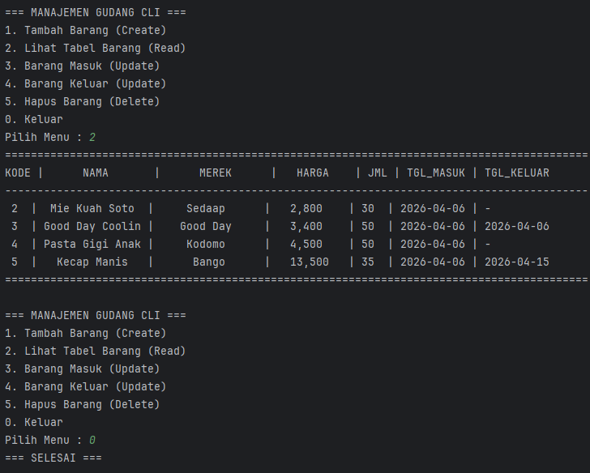

 # 📦 Manajemen Gudang CLI 

Sistem manajemen gudang sederhana berbasis Command Line Interface (CLI) yang dibuat menggunakan Python dan MySQL. Project ini bertujuan untuk memahami konsep dasar pengolahan data, interaksi database, serta alur pergerakan barang dalam sistem gudang.

---
## 📌 Fitur
CRUD Data Barang: Tambah, lihat, ubah, dan hapus data barang
Barang Masuk: Menambahkan stok barang secara otomatis
Barang Keluar: Mengurangi stok barang secara otomatis
Stok Dinamis: Jumlah stok selalu terupdate berdasarkan aktivitas
---

## 🛠️ Teknologi yang Digunakan
- Bahasa: Python 3
- Database: MySQL
- Interface: Command Line Interface (CLI)
- Library: `mysql-connector` (koneksi Python ke MySQL)
---

## ▶️ Cara Menjalankan

1. Pastikan Python dan MySQL sudah terinstall di sistem

2. Clone repository:

   ```bash
   git clone https://github.com/CountryIna/Sistem_Gudang.git
   cd Sistem_Gudang/V1
   ```

3. Install dependency:

   ```bash
   pip install mysql-connector-python python-dotenv
   ```

4. Setup database:

   ```bash
   SOURCE database/schema.sql;
   ```
   
5. Setup environment:

   ```bash
   cp .env.example .env
   ```
    Lalu sesuaikan isi file .env dengan konfigurasi database kamu.

6. Jalankan Program:

   ```bash
   python apps/main.py
   ```
---

## 💻 Contoh Hasil

Ini adaah hasil setelah dijalankan di terminal:



---

## 📚 Tujuan Pembelajaran

Project ini dibuat untuk:
- Melatih logika pemrograman
- Memahami koneksi Python ke MySQL
- Menguasai operasi CRUD
- Menggunakan `fetchone()` dan `fetchall()`
- Membuat tampilan tabel di terminal
---

## 🧠 Konsep yang Dipelajari
1. Konsep Pengambilan Data
   * fetchall()
       Mengambil semua data
       Digunakan untuk menampilkan tabel
       results = cursor.fetchall()
   * fetchone()
       Mengambil satu baris data
       Cocok untuk pencarian berdasarkan ID/kode
       data = cursor.fetchone()
2. Konsep Perulangan Data
    * for r in results:
    Penjelasan:
    - results = kumpulan data (list of tuple)
    - r = satu baris data
    - r[index] = isi kolom
3. Konsep Tampilan Tabel CLI
   * Menggunakan f-string formatting:
      - < : rata kiri
      - '>' : rata kanan
      - ^ : rata tengah
   * Inline If (Ternary)
     - tgl_k = r[6] if r[6] else "-"
     Artinya:
     - jika ada nilai → tampilkan
     - jika kosong (None) → tampilkan '-'
---

## ⚠️ Kendala yang Dihadapi
- Salah penulisan if
- Lupa menggunakan commit()
- Kesalahan parameter pada query SQL
- Salah memahami index (Python dimulai dari 0)
---

## 🚀 Rencana Pengembangan
**Versi 2:** Multi-user (Gudang & Kasir) + Sistem Transaksi
**Versi 3:** Implementasi Web menggunakan Django
---

## 🤝 Kontribusi

Kontribusi terbuka! Silakan fork repository ini dan kembangkan sesuai kebutuhan.

---

## 👨‍💻 Author

Created by **[Country Ina]**

---