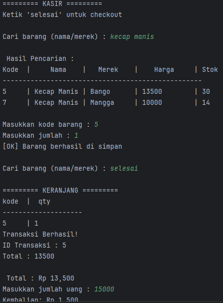

 # 📦 SIMPLE SISTEM INVENTORY & KASIR

Project ini mencakup pengelolaan stok barang serta sistem transaksi kasir sederhana dengan alur yang mendekati sistem nyata.

---
## 📌 Fitur
1. 🏬  GUDANG
- CRUD Data Barang: Tambah, lihat, ubah, dan hapus data barang
- Stok Dinamis: Jumlah stok selalu terupdate berdasarkan aktivitas
---
2. 🧾 Kasir
- Pencarian barang berdasarkan nama / merek
- Sistem keranjang (multi item dalam 1 transaksi)
- Transaksi dengan banyak item
- Perhitungan total otomatis
- Input pembayaran & perhitungan kembalian
- Update stok otomatis setelah transaksi
---

## 🛠️ Teknologi yang Digunakan
- Bahasa: Python 3
- Database: MySQL
- Interface: Command Line Interface (CLI)
- Library: 
  * `mysql-connector` 
  * `python-dotenv`
---

## ▶️ Cara Menjalankan

1. Pastikan Python dan MySQL sudah terinstall di sistem

2. Clone repository:

   ```bash
   git clone https://github.com/CountryIna/Simple-Sistem-Inventory-Kasir.git
   cd Simple-Sistem-Inventory-Kasir
   ```

3. Install dependency:

   ```bash
   pip install mysql-connector-python python-dotenv
   ```

4. Setup database:
Masuk ke terminal MySQL Anda, lalu jalankan perintah berikut untuk mengimpor skema (pastikan Anda berada di direktori utama project):

   ```bash
    CREATE DATABASE nama_database_anda;
    USE nama_database_anda;
    SOURCE database/schema.sql;
   ```
   
5. Setup environment:
Salin file contoh .env dan sesuaikan konfigurasinya:

   ```bash
   cp .env.example .env
   ```.
⚠️ Catatan: Buka file .env dan masukkan DB_USER, DB_PASSWORD, dan DB_NAME sesuai dengan database MySQL Anda.

6. Jalankan Program:

   ```bash
   python main.py
   ```
---

## 💻 Contoh Hasil

Ini adaah hasil setelah dijalankan di terminal:



---

## 🧠 Konsep yang Dipelajari
🔹 Database & Query
- `fetchone()` → ambil 1 data
- `fetchall()` → ambil semua data
- JOIN antar tabel

🔹 Transaksi Database
- `commit()` → simpan perubahan
- `rollback()` → batalkan jika error
- `Atomic query` (anti stok minus)

🔹 Python
- Looping (`for`)
- Dictionary (`list_barang`)
- Error handling (`try-except`)
- Function modular (pisah logic & UI)

🔹 CLI Formatting
- < : rata kiri
- `>` : rata kanan
- ^ : rata tengah
---

## ⚠️ Kendala yang Dihadapi
- Kesalahan parameter SQL (tuple vs int)
- Error pada query (kurang spasi / placeholder)
- Salah memahami index (dimulai dari 0)
- Sinkronisasi antara struktur DB dan code

---

## 🚀 Rencana Pengembangan
**Versi 1:** Sistem Gudang sederhana (CRUD barang) -> ✔️
**Versi 2:** Multi-user (Gudang & Kasir) + Sistem Transaksi -> ✔️
**Versi 3:** Implementasi Web menggunakan Django
---

## 🤝 Kontribusi

Kontribusi terbuka! Silakan fork repository ini dan kembangkan sesuai kebutuhan.

---

## 👨‍💻 Author

Created by **[Country Ina]**

---